# Phase 3 Implementation Plan - IT Department Student Resource Hub

This plan outlines the design and implementation strategy for **Phase 3** of the IT Department Student Resource Hub, extending the existing Phase 1 & 2 build with 5 major features without altering or breaking existing functionality.

---

## 🎯 Phase 3 Overview

```mermaid
graph TD
    A[Main App / Navigation] --> B[Placement Prep Hub]
    A --> C[Resume Builder]
    A --> D[Events & Hackathons Hub]
    A --> E[Peer Notes Sharing in Materials]
    A --> F[Rating & Review System]
    
    B --> B1[Company Profiles & CGPA Cutoffs]
    B --> B2[Interview Experiences & Tips]
    B --> B3[Share Experience Student Form]
    
    C --> C1[Form Input with Profile Auto-fill]
    C --> C2[Classic & Modern Templates]
    C --> C3[Live Preview & Export PDF]
    C --> C4[Saved Resumes Manager]
    
    D --> D1[Ongoing / Upcoming / Past Tabs]
    D --> D2[Countdown & Prize Highlights]
    D --> D3[Home Page Highlight Carousel]
    
    E --> E1[Student Contributed Badge]
    E --> E2[Upload Note Modal - Pending State]
    E --> E3[Admin Pending Notes Approval Queue]
    
    F --> F1[1-5 Star Interactive Component]
    F --> F2[Average Rating & Count Badges]
    F --> F3[Expandable Reviews & Comments]
```

---

## 📋 Proposed Features & Architecture

### 1. 💼 Placement Preparation Hub (`/placement`)
- **Main View**: Search & filter company cards (e.g., Google, TCS Digital, Amazon, Infosys SES) with CGPA cutoffs, drive dates, and eligibility criteria.
- **Interview Experiences**: View approved student interview experiences per company (rounds breakdown, HR tips, anonymous toggle).
- **"Share Your Experience" Modal**: Students can submit experiences after campus placement drives. New submissions default to `approved: false` and are sent to the Admin queue for review.
- **Prep Resources Section**: Curated aptitude practice links, DSA topic guides, and system design cheatsheets.
- **Admin Capabilities**: Add/edit company profiles, post drive announcements, and approve/reject student interview experiences.

### 2. 📝 Resume Builder (`/resumebuilder`)
- **Templates**: Choice between **Classic** (clean serif/sans corporate layout) and **Modern** (indigo sidebar layout).
- **Form Fields**: Profile information (auto-filled from user account), summary, skills (tag input), education, projects, certifications, and achievements.
- **Live Preview Panel**: Real-time rendering as fields are typed.
- **PDF Export**: Single-click PDF download via `html2pdf.js` / clean printable document rendering.
- **Resume Persistence**: Save, load, and delete multiple named resume versions per student under `users/{uid}/resumes/{resumeId}` in storage.

### 3. 📚 Peer Notes Sharing (Materials Library Extension)
- **Badging & Categories**: Added a **"Student Notes"** filter tag. Official documents show a **"Verified"** badge; student uploads display a **"Student-Contributed"** badge.
- **Student Note Upload Modal**: Students can upload notes (PDFs) with title, subject, semester, and description.
- **Admin Review Queue**: Submissions start with status `"pending"`. Added a **"Pending Notes"** tab in the Admin Center where admins can preview and approve or reject submissions.

### 4. ⭐ Rating & Review System
- **Interactive Component**: 1–5 star rating widget with optional text feedback.
- **Integration**: Placed on Study Material cards and AI Tool cards.
- **Calculations & Display**: Shows average star score (e.g. `★ 4.8 (12)`) and an expandable **"Student Reviews"** comment list.
- **User Uniqueness**: One rating per user per item; re-rating updates the existing entry.

### 5. 🏆 Events & Hackathons Hub (`/events`)
- **Auto-Categorized Tabs**: **Ongoing**, **Upcoming**, and **Past** events dynamically grouped based on current date vs `startDate`/`endDate`.
- **Event Cards**: Display banner image, title, type badge (Hackathon, Workshop, Competition, Seminar), level badge (Internal, National), organizer, prize pool, deadline countdown, and a direct **"Register Now"** button.
- **Event Detail Modal**: Clickable cards open a rich modal with full rules, timeline, and eligibility.
- **Home Carousel**: Integrated an **Events Highlight** carousel/grid on the Home page featuring active hackathons.
- **Admin Controls**: Add, edit, and delete events with banner URLs.

---

## 📂 Proposed File Changes

### [NEW] Components & Pages

#### 1. [NEW] [PlacementPrepHub.jsx](file:///d:/College/src/pages/PlacementPrepHub.jsx)
- Renders company drive cards, interview experiences feed, aptitude links, and "Share Experience" button.

#### 2. [NEW] [ResumeBuilderPage.jsx](file:///d:/College/src/pages/ResumeBuilderPage.jsx)
- Form inputs, profile auto-fill, template switcher (Classic vs Modern), live preview container, export to PDF, and version history manager.

#### 3. [NEW] [EventsPage.jsx](file:///d:/College/src/pages/EventsPage.jsx)
- Renders Ongoing, Upcoming, and Past event tabs, countdown timers, registration links, and event creation button for admins.

#### 4. [NEW] [RatingReviewComponent.jsx](file:///d:/College/src/components/RatingReviewComponent.jsx)
- Reusable 1–5 star rating widget with comment input, average rating badge, and expandable reviews list.

#### 5. [NEW] [ShareExperienceModal.jsx](file:///d:/College/src/components/ShareExperienceModal.jsx)
- Modal form for students to submit interview drive experiences with anonymous option.

#### 6. [NEW] [UploadStudentNoteModal.jsx](file:///d:/College/src/components/UploadStudentNoteModal.jsx)
- Modal form for students to submit peer notes tied to a subject for admin verification.

#### 7. [NEW] [EventDetailModal.jsx](file:///d:/College/src/components/EventDetailModal.jsx)
- Detail modal for hackathons/events displaying full schedule, prize breakdown, rules, and register button.

---

### [MODIFY] Existing Infrastructure & UI Components

#### 8. [MODIFY] [mockData.js](file:///d:/College/src/data/mockData.js)
- Add initial mock datasets for `INITIAL_COMPANIES`, `INITIAL_INTERVIEW_EXPERIENCES`, `INITIAL_EVENTS`, `INITIAL_PLACEMENT_RESOURCES`, and initial `ratings` on materials and AI tools.

#### 9. [MODIFY] [storageService.js](file:///d:/College/src/services/storageService.js)
- Implement storage methods for placement companies, interview experiences, peer notes approval, ratings, events, and user resume versions.

#### 10. [MODIFY] [DataContext.jsx](file:///d:/College/src/context/DataContext.jsx)
- Expose state and helper actions for companies, interview experiences, pending notes, ratings, events, and resumes.

#### 11. [MODIFY] [Navbar.jsx](file:///d:/College/src/components/Navbar.jsx)
- Add navigation links for **"Placement Prep"**, **"Events"**, and **"Resume Builder"**.
- Update Admin Center badge counters to include pending interview experiences and pending peer notes.

#### 12. [MODIFY] [MaterialsLibrary.jsx](file:///d:/College/src/pages/MaterialsLibrary.jsx)
- Add "Student Notes" category filter, "Student-Contributed" vs "Verified" badges, "Share Notes" upload button, and rating component integration.

#### 13. [MODIFY] [AIToolsHub.jsx](file:///d:/College/src/pages/AIToolsHub.jsx)
- Integrate rating component on AI tool cards.

#### 14. [MODIFY] [Home.jsx](file:///d:/College/src/pages/Home.jsx)
- Add an **Upcoming & Active Hackathons** highlight section on the dashboard with direct registration buttons.

#### 15. [MODIFY] [AdminFormsModal.jsx](file:///d:/College/src/components/AdminFormsModal.jsx)
- Add form schemas for adding/editing placement companies and hackathon/event entries.

#### 16. [MODIFY] [AdminManagementModal.jsx](file:///d:/College/src/components/AdminManagementModal.jsx)
- Add tabs for **Pending Notes** and **Pending Interview Experiences** to review and approve or reject submissions.

#### 17. [MODIFY] [App.jsx](file:///d:/College/src/App.jsx)
- Wire up new main navigation tabs (`placement`, `events`, `resumebuilder`) and modal dialog triggers.

---

## 🧪 Verification Plan

### Automated Tests / Lint Checks
- Build check using `npm run build` or Vite compile verification to ensure zero syntax or type errors.

### Manual Verification Flow
1. **Placement Prep Hub**:
   - Browse companies, view experience breakdown per company, submit a new interview experience, approve it in Admin Center, verify it appears publicly.
2. **Resume Builder**:
   - Auto-fill student profile info, switch templates (Classic vs Modern), edit fields, verify live preview updates immediately, export to PDF, save resume version, reload saved version.
3. **Peer Notes Sharing**:
   - Click "Share Notes" in Materials Library, upload a PDF note, check that it defaults to pending state and is hidden from public view, open Admin Center -> Pending Notes tab, approve note, verify it now shows under "Student Notes" with a "Student-Contributed" badge.
4. **Rating & Review System**:
   - Rate a material / AI tool 5 stars with a comment, verify average rating recalculates instantly, expand recent comments to view review.
5. **Events & Hackathons Hub**:
   - Navigate to Events, switch between Ongoing / Upcoming / Past tabs, open event detail modal, click "Register Now", check Home page active hackathons highlight carousel.

---

## 💬 User Review Required

> [!NOTE]
> Please review the plan above. All Phase 1 and Phase 2 features will remain completely intact while adding Placement Prep, Resume Builder, Peer Notes, Star Ratings, and Events Hub.
